

# my-proyecto-millonario

Realización de la tarea "Trabajo diario a través de git".

---

## Paso 1

Creo el repositorio en GitHub y desde local creo el fichero README y realizo el commit inicial, configurando el origen remoto: 

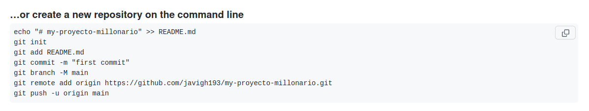

Si hubiese clonado el repositorio directamente, no tendría que haber indicado el origen remoto, ya que se hubiese configurado al realizar el clonado.

## Paso 2

Creo el fichero "privado.txt" y el directorio "privada", los incluyo en el fichero "gitignore":

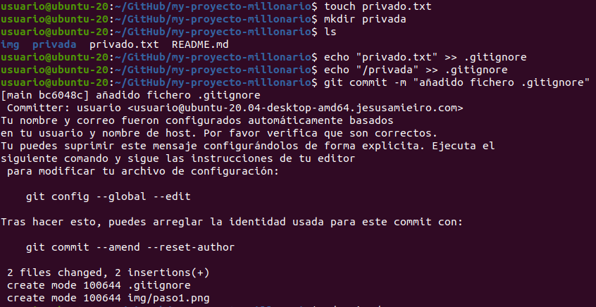

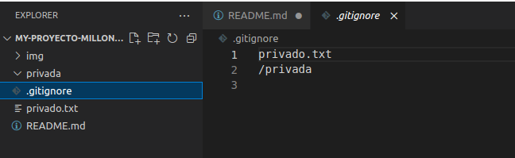

Como he añadido tanto el fichero como el directorio al "gitignore" antes de realizar el "push", git no realizará el seguimiento de los mismos y no los subirá. Si hubiese realizado un "push" antes de incluirlos en "gitignore", tendría que eliminar la información que ya está almacenada por git para el seguimiento de los mismos con: "git rm --cached".

## Paso 3

Creo un fichero "1.txt":

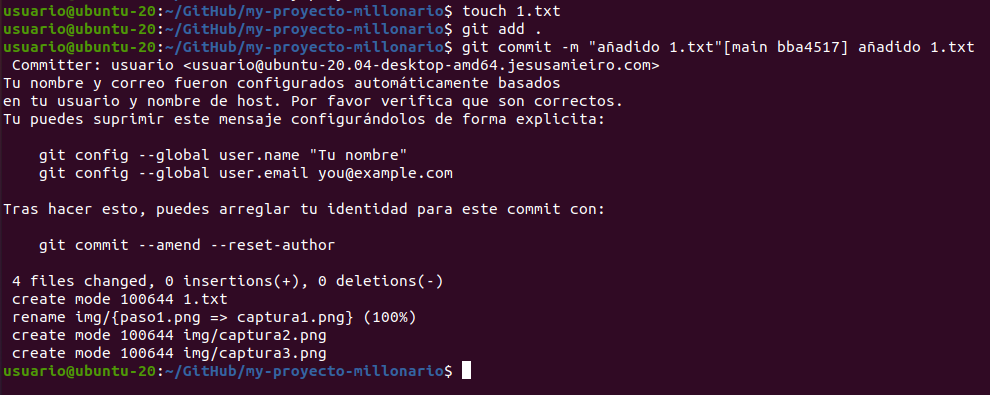

Con "git add" añado los ficheros nuevos y los que han sido modificados al "staging area". Con el "git commit" genero una instantánea ("snapshot") de mi repositorio, teniendo en cuenta la información que fue incorporada previametne al "staging area". Los dos comandos deben ser utilizados conjuntamente de manera frecuente para ir reflejando los cambios que va experimentando el repositiorio. 

## Paso 4

Creo un tag:

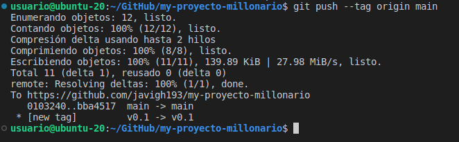

El tag es una marca de un momento importante en el histórico del proyecto. Te permite indicar cuando hay un cambio de versión y asociar información a dicha indicación, como por ejemplo quién creo el tag, su correo, la fecha, etc. 

## Paso 5 

Creo la rama v0.2, me posiciono en ella y creo el fichero "2.txt":

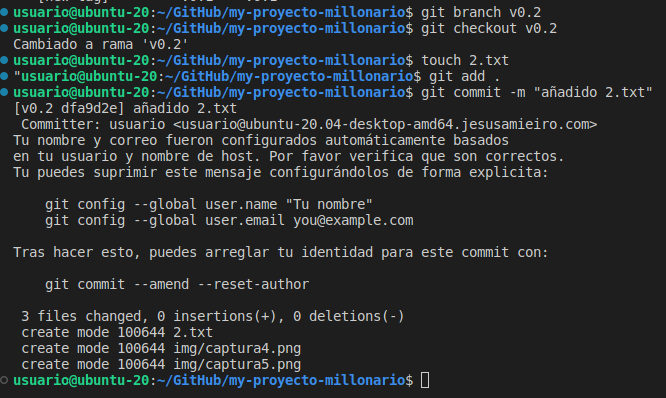

Trabajar con distintas ramas permite el desarrollo en paralelo partiendo de una misma versión estable del codigo, de esta manera los diferentes códigos en desarrollo pueden ser trabajados y comprobados por separado antes de su fusión con la rama de la versión estable. 

Subo los cambios al repositorio remoto:

## Paso 6

Realizo un merge con la rama principal ("main" en mi caso):

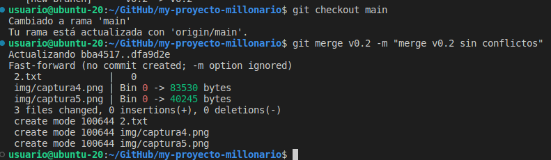

No hay conflictos entre las ramas, ya que lo único que se ha realizado es la creación de nuevos ficheros en la rama que se fusiona. Si hubiese ralizado cambios en un mismo fichero en las dos ramas, y estos cambios fuesen diferentes, entonces se daría un conflicto entre ellas al realizar el "merge".

## Paso 7

Hago cambios en los ficheros de las distintas ramas para generar un conflicto entre ellas:

En la rama main:

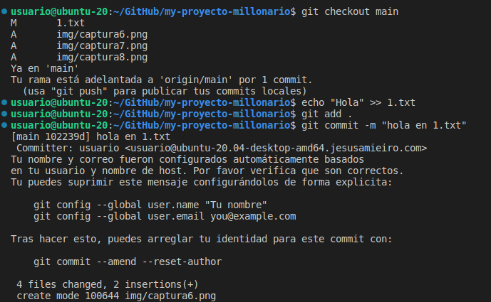

En la rama v0.2:

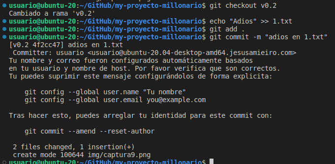

Vuelvo a la rama main para ralizar el "merge":

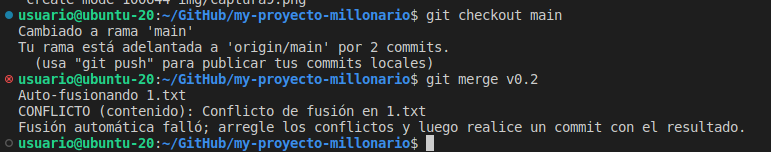

Como pretendía, surge un conflicto entre las distintas versiones del fichero 1.txt.

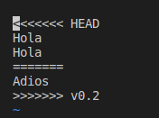

Edito el fichero para solucionar el conflicto y añado los cambios:

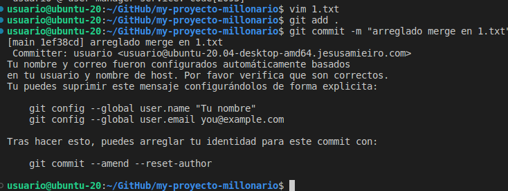

## Paso 8

Listo las ramas:

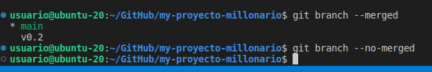

Creo un tag y borro rama, listo commits con ramas y tags:

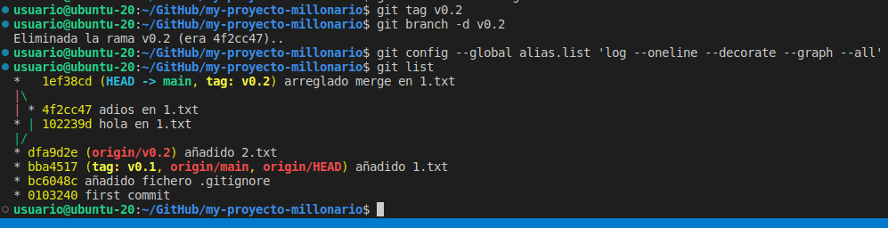

